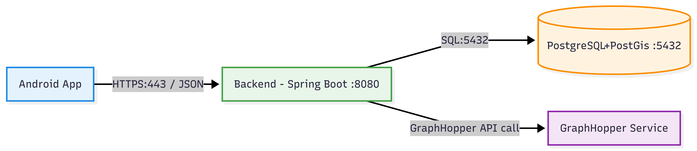
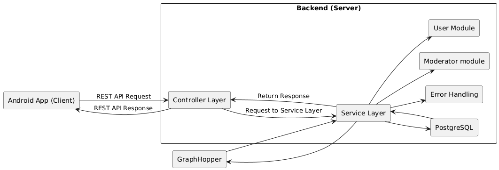

## GoodRoad 

**Авторы**: ```Городкова Ксения```, ```Грудцына Виктория```, ```Толстограева Виктория```

## Описание проекта
**GoodRoad** — это мобильное приложение для построения пеших инклюзивных маршрутов. В отличие от стандартной навигации по кратчайшему пути, приложение подстраивает путь под ограничения здоровья пользователя. Если полностью безбарьерного маршрута нет, GoodRoad показывает проблемные участки и дает возможность запросить помощь волонтера.

Данные о доступности инфраструктуры собираются пользователями в игровом формате с системой бонусов. Запросы на помощь находятся в отдельной ленте.

## Основная функциональность

- **Профиль пользователя:**
    - Выбор препятствий, которые нужно избегать при построении маршрута;
    - Интерактивные задания, связанные с оценкой объектов и волонтерством;
    - Рейтинг и система начисления баллов за отзывы и волонтерство;
    - Лента заявок на помощь с фильтрами по местоположению и времени;
    - Подача заявки на улучшение инфраструктуры.
- **Профиль модератора:**
    - Обработка заявок о помощи: система реагирования на критические ситуации;
    - Модерация отзывов;
- **Карта и маршруты:**
    - Влияние отзывов на построение пути.
    - Построение 3 вариантов маршрута: **доступный**, **быстрый**, **компромиссный**;
    - Выделение проблемных участков и карточки объектов с деталями;
    - История маршрутов и сохранение последнего построенного пути.

## MVP

- **Регистрация / вход / восстановление доступа.**
- **Маршрутизация:**
    - Выбор избегаемых препятствий в профиле;
    - Построение маршрута;
    - Отображение маршрута и проблемных участков;
    - Хранение препятствий (тип и тяжесть).
- **Отзывы:**
    - Чек-лист для оценивания;
    - Прикрепление фотографии (опционально);
    - Учет отзывов в маршрутизации.
- **Модерация:**
    - Проверка отзывов;
    - Управление младшими модераторами (в случае главного).


## Технологии

<table>

  <tr>
    <th>Компонент</th>
    <th>Технологии / Инструменты</th>
  </tr>

  <tr>
    <td><strong>UI</strong></td>
    <td>Android SDK, Material Components/ Jetpack Compose</td>
  </tr>

  <tr>
    <td><strong>Карты</strong></td>
    <td>Mapbox Android SDK (слои для маршрутов и препятствий)</td>
  </tr>

  <tr>
    <td><strong>Работа с геоданными</strong></td>
    <td>Android Location API</td>
  </tr>

  <tr>
    <td><strong>Онлайн базы данных</strong></td>
    <td>PostgreSQL, PostGis</td>
  </tr>

  <tr>
    <td><strong>Оффлайн базы данных</strong></td>
    <td>Room (кэш профиля, ограничений, препятствий и последнего маршрута)</td>
  </tr>

  <tr>
    <td><strong>Геометрия</strong></td>
    <td>JTS (офлайн-операции с геометрией при учете препятствий)</td>
  </tr>

  <tr>
    <td><strong>Сеть/Сервер</strong></td>
    <td>Spring Boot, Lombok</td>
  </tr>

  <tr>
    <td><strong>Работа с JSON</strong></td>
    <td>Jackson</td>
  </tr>

  <tr>
    <td><strong>Алгоритм построения маршрута</strong></td>
    <td>GraphHooper</td>
  </tr>

  <tr>
    <td><strong>Тестирование</strong></td>
    <td>Spring Boot, Postman</td>
  </tr>

  <tr>
    <td><strong>*Голосовое сопровождение</strong></td>
    <td>Android TTS</td>
  </tr>
</table>

## Структура проекта

**Архитектура сервиса**


**Архитектура клиента**
TODO

**Архитектура клиентского приложения**


**Архитектура сервера**
